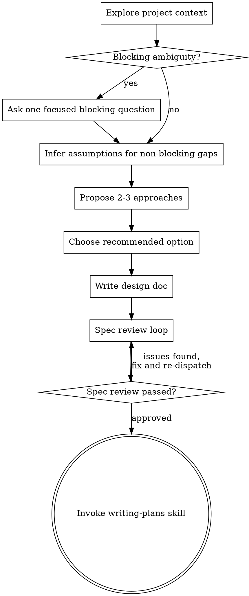

# Brainstorming Ideas Into Designs

Help turn ideas into fully formed designs and specs through autonomous analysis.

Start by understanding the current project context, identify what is missing, and make the smallest reasonable set of assumptions needed to move forward. Explore 2-3 approaches internally, choose the recommended one, document assumptions and risks, then write the design.

<HARD-GATE>
Do NOT invoke any implementation skill, write any code, scaffold any project, or take any implementation action until you have completed a design pass and written the spec. User approval is NOT required in this branch unless a high-risk ambiguity would materially change the architecture, scope, or safety of the work.
</HARD-GATE>

## Anti-Pattern: "This Is Too Simple To Need A Design"

Every project goes through this process. A todo list, a single-function utility, a config change — all of them. "Simple" projects are where unexamined assumptions cause the most wasted work. The design can be short (a few sentences for truly simple projects), but you MUST do the design pass and capture your assumptions explicitly.

## Checklist

You MUST create a task for each of these items and complete them in order:

1. **Explore project context** — check files, docs, recent commits
2. **Check for blocking ambiguity** — ask the user a focused question only if a missing decision would materially change architecture, scope, or safety
3. **Infer assumptions for non-blocking gaps** — record them explicitly in the design
4. **Propose 2-3 approaches** — with trade-offs and your recommendation
5. **Choose the recommended option** — do not stop for approval unless blocked by high-risk ambiguity
6. **Write design doc** — save to `docs/superpowers/specs/YYYY-MM-DD-<topic>-design.md` and commit
7. **Spec review loop** — dispatch spec-document-reviewer subagent with precisely crafted review context (never your session history); fix issues and re-dispatch until approved (max 3 iterations, then surface to human)
8. **Transition to implementation** — invoke writing-plans skill to create implementation plan

## Process Flow

**The terminal state is invoking writing-plans.** Do NOT invoke frontend-design, mcp-builder, or any other implementation skill. The ONLY skill you invoke after brainstorming is writing-plans.

## The Process

**Understanding the idea:**

- Check out the current project state first (files, docs, recent commits)
- Before asking detailed questions, assess scope: if the request describes multiple independent subsystems (e.g., "build a platform with chat, file storage, billing, and analytics"), flag this immediately. Don't spend questions refining details of a project that needs to be decomposed first.
- If the project is too large for a single spec, help the user decompose into sub-projects: what are the independent pieces, how do they relate, what order should they be built? Then brainstorm the first sub-project through the normal design flow. Each sub-project gets its own spec → plan → implementation cycle.
- For appropriately-scoped projects, infer purpose, constraints, and success criteria from the request and the codebase
- If information is missing but the risk is low, make a reasonable assumption and record it explicitly
- Ask the user a question only when the missing decision is genuinely blocking and would materially change the architecture, scope, or safety of the work
- When you do need to ask, ask one focused question and then continue

**Exploring approaches:**

- Propose 2-3 different approaches with trade-offs
- Choose the recommended option yourself
- Record why it wins and why the alternatives were rejected
- Do not stop to ask the user to pick among options unless the trade-off is truly irreversible or high-risk

**Presenting the design:**

- Once you believe you understand what you're building, write the design in the spec
- Scale each section to its complexity: a few sentences if straightforward, up to 200-300 words if nuanced
- Include an explicit assumptions section whenever you had to infer requirements
- Cover: architecture, components, data flow, error handling, testing
- Be ready to revise if the review loop surfaces issues or if a blocking ambiguity is later uncovered

**Design for isolation and clarity:**

- Break the system into smaller units that each have one clear purpose, communicate through well-defined interfaces, and can be understood and tested independently
- For each unit, you should be able to answer: what does it do, how do you use it, and what does it depend on?
- Can someone understand what a unit does without reading its internals? Can you change the internals without breaking consumers? If not, the boundaries need work.
- Smaller, well-bounded units are also easier for you to work with - you reason better about code you can hold in context at once, and your edits are more reliable when files are focused. When a file grows large, that's often a signal that it's doing too much.

**Working in existing codebases:**

- Explore the current structure before proposing changes. Follow existing patterns.
- Where existing code has problems that affect the work (e.g., a file that's grown too large, unclear boundaries, tangled responsibilities), include targeted improvements as part of the design - the way a good developer improves code they're working in.
- Don't propose unrelated refactoring. Stay focused on what serves the current goal.

## After the Design

**Documentation:**

- Write the validated design (spec) to `docs/superpowers/specs/YYYY-MM-DD-<topic>-design.md`
  - (User preferences for spec location override this default)
- Use elements-of-style:writing-clearly-and-concisely skill if available
- Commit the design document to git

**Spec Review Loop:**
After writing the spec document:

1. Dispatch spec-document-reviewer subagent (see spec-document-reviewer-prompt.md)
2. If Issues Found: fix, re-dispatch, repeat until Approved
3. If loop exceeds 3 iterations, surface to human for guidance

**Implementation:**

- Invoke the writing-plans skill to create a detailed implementation plan
- Do NOT invoke any other skill. writing-plans is the next step.

## Key Principles

- **Assume unless blocked** - Default to explicit assumptions for low-risk ambiguity
- **Ask only when necessary** - Questions are for high-risk blockers, not normal flow
- **YAGNI ruthlessly** - Remove unnecessary features from all designs
- **Explore alternatives** - Always propose 2-3 approaches before settling
- **Autonomous execution** - Choose the recommendation instead of asking the user to pick
- **Be flexible** - Revisit assumptions if new evidence shows they were wrong

## Visual Companion

A browser-based companion for showing mockups, diagrams, and visual options during brainstorming. Available as a tool — not a mode. Accepting the companion means it's available for questions that benefit from visual treatment; it does NOT mean every question goes through the browser.

**Autonomous-mode rule:** Do not proactively offer the visual companion in this branch. Use it only if the user explicitly asks for visual collaboration or if a higher-priority instruction requires it.

**Per-question decision:** Even after the user accepts, decide FOR EACH QUESTION whether to use the browser or the terminal. The test: **would the user understand this better by seeing it than reading it?**

- **Use the browser** for content that IS visual — mockups, wireframes, layout comparisons, architecture diagrams, side-by-side visual designs
- **Use the terminal** for content that is text — requirements questions, conceptual choices, tradeoff lists, A/B/C/D text options, scope decisions

A question about a UI topic is not automatically a visual question. "What does personality mean in this context?" is a conceptual question — use the terminal. "Which wizard layout works better?" is a visual question — use the browser.

If they agree to the companion, read the detailed guide before proceeding:
`skills/brainstorming/visual-companion.md`
